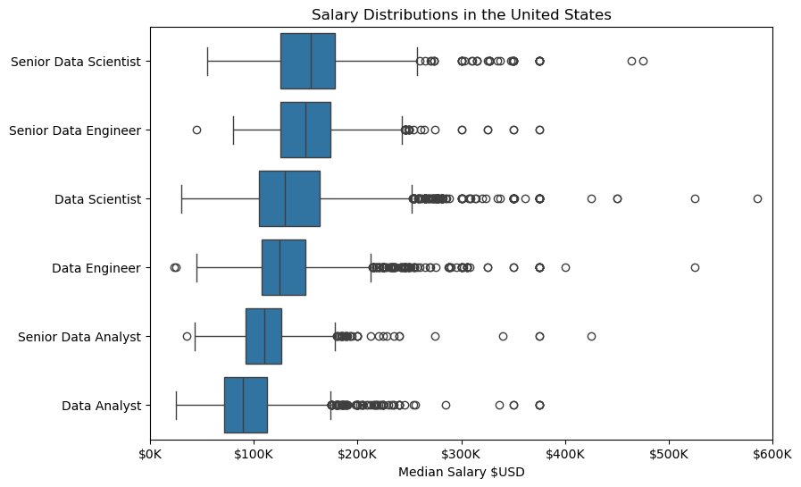

# The Analysis

## 1. What are the most demanded skills for the top 3 most popular data roles?

To find the most demanded skills for the top 3 most popular data roles. I filtered out those positions by which ones were the most popular, and got the the top 5 skills for these top 3 roles. This query highlights the most popular job titles and their top skills, showing which skills I should pay attention to depending on the role I'm targeting.

View my notebook:
[2_Skill_Demanded.ipynb](3_Project/2_Skill_Demand.ipynb)

### Visualize Data

```python
fig, ax = plt.subplots(len(job_titles), 1, figsize=(8, 8))

for i, job_title in enumerate(job_titles):
    df_plot = df_skills_perc[df_skills_perc['job_title_short'] == job_title].head(5)
    sns.barplot(df_plot,x='percentage', y='job_skills', ax=ax[i], hue='percentage', palette='dark:b_r')

plt.show()
```
### Results


### Insights


1. Python and SQL are must-have skills across all data roles.

2. Excel and Tableau are still very relevant for Data Analysts but less so for Engineers and Scientists.

3. Cloud and Big Data tools (AWS, Azure, Spark) are essential for Data Engineers.

4. R and SAS are more niche or legacy tools — useful but not primary.

5. Role Focus Differentiation:
    - Analysts: Reporting, visualization, business interaction.
    - Engineers: Infrastructure, cloud, data pipelines.
    - Scientists: Advanced analytics, modeling, machine learning.

6. SQL is highly demanded for Data Engineers (68%) and equally for Analysts and Scientists (51%), while Python peaks for Data Scientists (72%), followed by Engineers (65%) and Analysts (27%).

## 2. How are in-demand skills are trending for Data Analysts?

### Visualize Data

```python
sns.lineplot(df_plot, dashes=False, palette='tab10', legend=False)
sns.set_theme(style='ticks')
sns.despine()

for i in range(5):
    plt.text(3, df_plot.iloc[4, i], df_plot.columns[i])

plt.tight_layout()

```

### Results


*Bar graph visualizing the trending top skills for Data Analysts in the US in 2023.*

### Insights

- SQL consistently led demand for Data Analysts throughout 2023, peaking at ~54% in January and maintaining dominance across all months.
- Excel held steady around 42% for most of the year but saw a noticeable drop in the final quarter, briefly rebounding in December.
- Python and Tableau trended closely together between 26–30%, while SAS remained the least requested skill, fluctuating between 18–22%.

## 3. How well do jobs and skills pay for Data Analysts?

### Visualize Data

```python
sns.boxplot(data=df_US_top6, x='salary_year_avg', y='job_title_short', order=job_order)
plt.xlim(0, 600000)
plt.title('Salary Distributions in the United States')
plt.xlabel('Median Salary $USD')
plt.ylabel('')
```
### Results



*Box Plot graph visualizing the salary distributions in the US.*

### Insights

- Senior roles (e.g., Senior Data Scientist and Senior Data Engineer) show noticeably higher median salaries, with most salaries concentrated between $150K–$200K, and some outliers even approaching $600K.
- Data Scientists and Data Engineers (non-senior) have comparable distributions, both centered around $130K–$160K, but Data Scientists tend to have a slightly wider range and more high-end outliers.
- Data Analysts and Senior Data Analysts earn significantly less than their engineering and science counterparts, with most Data Analysts falling between $70K–$110K, and seniors reaching around $130K at the median.

### Highest Paid and Most In-Demand Skills for Data Analysts

### Visualize Data

```python

fig, ax = plt.subplots(2, 1, figsize=[9,6])
sns.barplot(data=df_top_pay,x='median', y='job_skills', ax=ax[0], hue='median', palette='dark:b_r')

df_in_demand_skill_sort = df_in_demand_skill.sort_values(by='median', ascending=False)
sns.barplot(data=df_in_demand_skill_sort,x='median', y='job_skills', ax=ax[1], hue='median', palette='light:b')

fig.tight_layout()
plt.show()
```

### Results


*Bar graph visualizing the highest paid and most in-demand skills for Data Analysts.*

### Insights

- Highest paid skills like dplyr, bitbucket, and gitlab offer median salaries close to $190K–$200K, indicating that niche or specialized tools yield premium compensation for Data Analysts.
- Most in-demand skills, including python, tableau, and r, offer lower median salaries (around $90K–$95K), suggesting that widespread use may dilute salary premiums.
- There's a disconnect between demand and pay—tools like excel and word are frequently requested but command the lowest median salaries, highlighting that high demand doesn’t always equate to high compensation.
